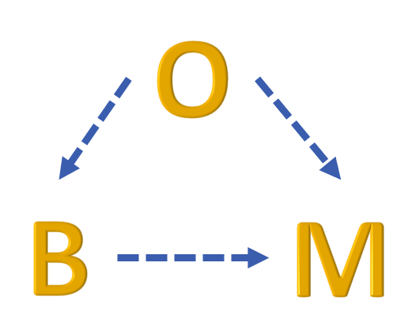

<!-- Improved compatibility of back to top link: See: https://github.com/othneildrew/Best-README-Template/pull/73 -->
<a name="readme-top"></a>
<!--
*** Thanks for checking out the Best-README-Template. If you have a suggestion
*** that would make this better, please fork the repo and create a pull request
*** or simply open an issue with the tag "enhancement".
*** Don't forget to give the project a star!
*** Thanks again! Now go create something AMAZING! :D
-->


<!-- PROJECT SHIELDS -->
<!--
*** I'm using markdown "reference style" links for readability.
*** Reference links are enclosed in brackets [ ] instead of parentheses ( ).
*** See the bottom of this document for the declaration of the reference variables
*** for contributors-url, forks-url, etc. This is an optional, concise syntax you may use.
*** https://www.markdownguide.org/basic-syntax/#reference-style-links
-->
[![Contributors][contributors-shield]][contributors-url]
[![Forks][forks-shield]][forks-url]
[![Stargazers][stars-shield]][stars-url]
[![Issues][issues-shield]][issues-url]
[![License][license-shield]][license-url]
[![LinkedIn][linkedin-shield]][linkedin-url]


<!-- PROJECT LOGO -->
<br />
<div align="center">
  <a href="https://github.com/ontological-behavior-modeling/tester">
    
  </a>

<h3 align="center">Tester Repo</h3>

  <p align="center">
    This project is a sandbox for testing automation and maintenance items before implementing in the main repo.

NOTE: This README is under construction 
    <br />
    <a href="https://github.com/ontological-behavior-modeling/tester/wiki"><strong>Explore the docs »</strong></a>
    <br />
    <br />
    <a href="https://github.com/ontological-behavior-modeling/tester">View Demo</a>
    ·
    <a href="https://github.com/ontological-behavior-modeling/tester/issues">Report Bug</a>
    ·
    <a href="https://github.com/ontological-behavior-modeling/tester/issues">Request Feature</a>
  </p>
</div>


<!-- TABLE OF CONTENTS -->
<details>
  <summary>Table of Contents</summary>
  <ol>
    <li>
      <a href="#about-the-project">About The Project</a>
      <ul>
        <li><a href="#built-with">Built With</a></li>
      </ul>
    </li>
    <li>
      <a href="#getting-started">Getting Started</a>
      <ul>
        <li><a href="#prerequisites">Prerequisites</a></li>
        <li><a href="#installation">Installation</a></li>
      </ul>
    </li>
    <li><a href="#usage">Usage</a></li>
    <li><a href="#roadmap">Roadmap</a></li>
    <li><a href="#contributing">Contributing</a></li>
    <li><a href="#license">License</a></li>
    <li><a href="#contact">Contact</a></li>
    <li><a href="#acknowledgments">Acknowledgments</a></li>
  </ol>
</details>


<!-- ABOUT THE PROJECT -->
## About The Project

[![Product Name Screen Shot][product-screenshot]](https://example.com)


<p align="right">(<a href="#readme-top">back to top</a>)</p>


### Built With

* [![Eclipse][eclipse-ide]][eclipse-url]
* [![JUnit][junit-shield]][junit-url]
* [![IntelliJ][intellij-shield]][intellij-url]
* [![AlloyAnalyzer][alloy_analyzer-shield]][alloy_analyzer-url]

<p align="right">(<a href="#readme-top">back to top</a>)</p>


<!-- GETTING STARTED -->
## Getting Started

TBD

[comment]: <> (This is an example of how you may give instructions on setting up your project locally.)

[comment]: <> (To get a local copy up and running follow these simple example steps.)

### Prerequisites

TBD

[comment]: <> (This is an example of how to list things you need to use the software and how to install them.)

[comment]: <> (* npm)

[comment]: <> (  ```sh)

[comment]: <> (  npm install npm@latest -g)

[comment]: <> (  ```)

### Installation
TBD

[comment]: <> (1. Get a free API Key at [https://example.com]&#40;https://example.com&#41;)

[comment]: <> (2. Clone the repo)

[comment]: <> (   ```sh)

[comment]: <> (   git clone https://github.com/ontological-behavior-modeling/tester.git)

[comment]: <> (   ```)

[comment]: <> (3. Install NPM packages)

[comment]: <> (   ```sh)

[comment]: <> (   npm install)

[comment]: <> (   ```)

[comment]: <> (4. Enter your API in `config.js`)

[comment]: <> (   ```js)

[comment]: <> (   const API_KEY = 'ENTER YOUR API';)

[comment]: <> (   ```)

<p align="right">(<a href="#readme-top">back to top</a>)</p>


<!-- USAGE EXAMPLES -->
## Usage

TBD

[comment]: <> (Use this space to show useful examples of how a project can be used. Additional screenshots, code examples and demos work well in this space. You may also link to more resources.)

[comment]: <> (_For more examples, please refer to the [Documentation]&#40;https://example.com&#41;_)

<p align="right">(<a href="#readme-top">back to top</a>)</p>


<!-- ROADMAP -->
## Roadmap

TBD

[comment]: <> (- [ ] Feature 1)

[comment]: <> (- [ ] Feature 2)

[comment]: <> (- [ ] Feature 3)

[comment]: <> (    - [ ] Nested Feature)

[comment]: <> (See the [open issues]&#40;https://github.com/ontological-behavior-modeling/tester/issues&#41; for a full list of proposed features &#40;and known issues&#41;.)

<p align="right">(<a href="#readme-top">back to top</a>)</p>


<!-- CONTRIBUTING -->
## Contributing

TBD

[comment]: <> (Contributions are what make the open source community such an amazing place to learn, inspire, and create. Any contributions you make are **greatly appreciated**.)

[comment]: <> (If you have a suggestion that would make this better, please fork the repo and create a pull request. You can also simply open an issue with the tag "enhancement".)

[comment]: <> (Don't forget to give the project a star! Thanks again!)

[comment]: <> (1. Fork the Project)

[comment]: <> (2. Create your Feature Branch &#40;`git checkout -b feature/AmazingFeature`&#41;)

[comment]: <> (3. Commit your Changes &#40;`git commit -m 'Add some AmazingFeature'`&#41;)

[comment]: <> (4. Push to the Branch &#40;`git push origin feature/AmazingFeature`&#41;)

[comment]: <> (5. Open a Pull Request)

<p align="right">(<a href="#readme-top">back to top</a>)</p>


<!-- LICENSE -->
## License

Distributed under the BSD-3 License. See `LICENSE.txt` for more information.

<p align="right">(<a href="#readme-top">back to top</a>)</p>


<!-- CONTACT -->
## Contact

Project Link: [https://github.com/ontological-behavior-modeling/tester](https://github.com/ontological-behavior-modeling/tester)

<p align="right">(<a href="#readme-top">back to top</a>)</p>


<!-- ACKNOWLEDGMENTS -->
## Acknowledgments

* [Conrad Bock](https://www.nist.gov/people/conrad-bock)
* [Raphael Barbau](https://www.nist.gov/people/raphael-barbau)
* []()

<p align="right">(<a href="#readme-top">back to top</a>)</p>


<!-- MARKDOWN LINKS & IMAGES -->
<!-- https://www.markdownguide.org/basic-syntax/#reference-style-links -->
[contributors-shield]: https://img.shields.io/github/contributors/ontological-behavior-modeling/tester.svg?style=for-the-badge
[contributors-url]: https://github.com/ontological-behavior-modeling/tester/graphs/contributors
[forks-shield]: https://img.shields.io/github/forks/ontological-behavior-modeling/tester.svg?style=for-the-badge
[forks-url]: https://github.com/ontological-behavior-modeling/tester/network/members
[stars-shield]: https://img.shields.io/github/stars/ontological-behavior-modeling/tester.svg?style=for-the-badge
[stars-url]: https://github.com/ontological-behavior-modeling/tester/stargazers
[issues-shield]: https://img.shields.io/github/issues/ontological-behavior-modeling/tester.svg?style=for-the-badge
[issues-url]: https://github.com/ontological-behavior-modeling/tester/issues
[license-shield]: https://img.shields.io/github/license/ontological-behavior-modeling/tester.svg?style=for-the-badge
[license-url]: https://github.com/ontological-behavior-modeling/tester/blob/master/LICENSE.txt
[linkedin-shield]: https://img.shields.io/badge/-LinkedIn-black.svg?style=for-the-badge&logo=linkedin&colorB=555
[linkedin-url]: https://linkedin.com/in/linkedin_username
[eclipse-url]: https://eclipseide.org/
[eclipse-ide]: https://img.shields.io/badge/eclipse_modeling_framework-2C2255?style=for-the-badge&logo=eclipseide
[JUnit-shield]: https://img.shields.io/badge/junit5-25A162?style=for-the-badge&logo=junit5&logoColor=white
[JUnit-url]: https://junit.org/junit5/
[intellij-shield]: https://img.shields.io/badge/intellij_idea-000000?style=for-the-badge&logo=intellijidea
[intellij-url]: https://www.jetbrains.com/
[alloy_analyzer-shield]: https://img.shields.io/badge/-Alloy%20Analyzer-green
[alloy_analyzer-url]: https://alloytools.org/
